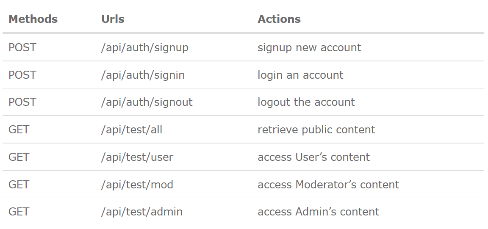
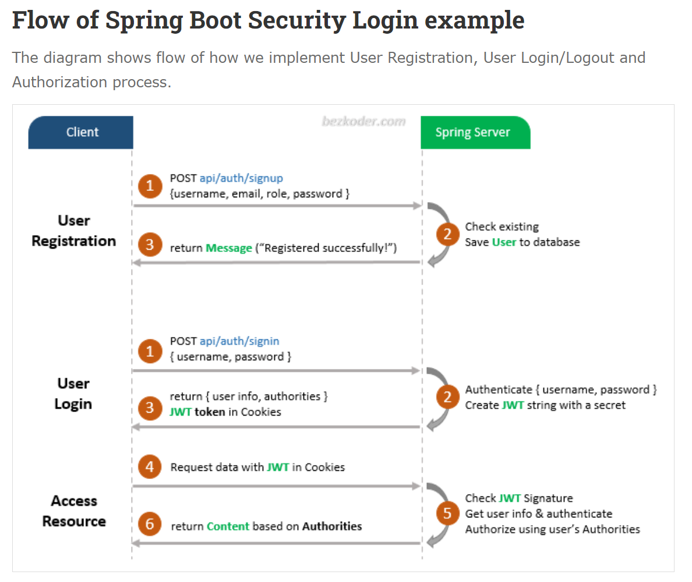
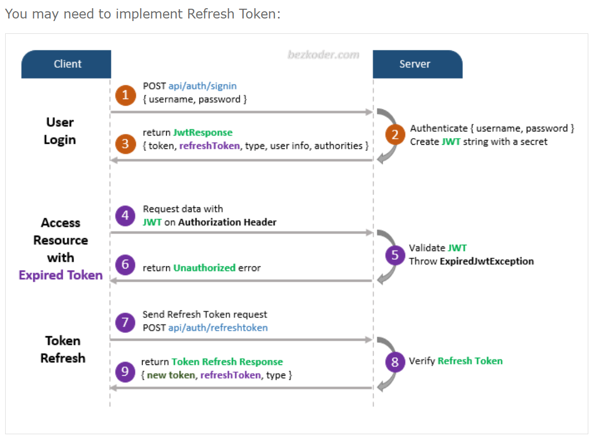
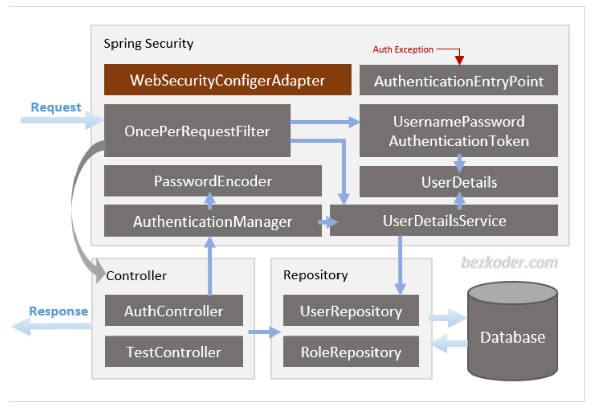

# Spring Boot Security Login example with JWT and H2 Database
### build a Spring Boot, Spring Security: Login and Registration example (Rest API) that supports JWT with HttpOnly Cookie working with H2 Database.
#### Goals
##### Appropriate Flow for User Login and Registration with JWT and HttpOnly Cookie
##### Spring Boot Rest Api Architecture with Spring Security
##### How to configure Spring Security to work with JWT
##### How to define Data Models and association for Authentication and Authorization
##### Way to use Spring Data JPA to interact with H2 Database
##### Overview
##### build a Spring Boot + Spring Security application with JWT in that:
##### User can sign up new account (registration), or login with username & password.
##### By User’s role (admin, moderator, user), we authorize the User to access resources.

#### APIs 

#### Flow of Spring Boot Security Login example

### Note : A legal JWT will be stored in "HttpOnly Cookie" if Client accesses protected resources.

More details at: Spring Boot Refresh Token with JWT example : https://www.bezkoder.com/spring-boot-refresh-token-jwt/

### Spring Boot Architecture with Spring Security

### Spring Security

#### – WebSecurityConfigurerAdapter is the crux of our security implementation.
#### – It provides HttpSecurity configurations to configure cors, csrf, session management, rules for protected resources.

### We can also extend and customize the default configuration that contains the elements below.
#### – `UserDetailsService` interface has a method to load User by username and returns a `UserDetails object` that Spring Security can use for authentication and validation.
#### – `UserDetails` contains necessary information (such as: username, password, authorities) to build an Authentication object.
#### – `UsernamePasswordAuthenticationToken` gets {username, password} from `login Request`, `AuthenticationManager` will use it to authenticate a `login account`.
#### – `AuthenticationManager` has a `DaoAuthenticationProvider` (with help of `UserDetailsService` & `PasswordEncoder`) to validate `UsernamePasswordAuthenticationToken object`.
If successful, `AuthenticationManager` returns a fully populated `Authentication object` (including granted authorities).
#### – `OncePerRequestFilter` makes a single execution for each request to our API.
It provides a `doFilterInternal()` method that we will `implement parsing` & `validating JWT`, `loading User details (using UserDetailsService)`, 
checking `Authorization`(using `UsernamePasswordAuthenticationToken`).
#### – `AuthenticationEntryPoint` will `catch authentication error`.

#### Repository: has interfaces that extend Spring Data JPA JpaRepository to interact with Database.
Repository contains `UserRepository` & `RoleRepository` to work with `Database`, will be imported into `Controller`.

### Models: defines two main models for Authentication (User) & Authorization (Role). They have many-to-many relationship.
##### ● User: id, username, email, password, roles
##### ● Role: id, name

### Payload: defines classes for `Request` and `Response` objects
We also have `application.properties` for configuring Spring Datasource, Spring Data JPA and `App properties` (such as `JWT Secret string` or `Token expiration time`).

### Controller: handle signup/login requests & authorized requests
#### `Controller` receives and handles request after it was filtered by `OncePerRequestFilter`.
#### – `AuthController` handles signup/login requests --> @PostMapping(‘/signup’), @PostMapping(‘/signin’), @PostMapping(‘/signout’)
#### – `TestController` has accessing protected resource methods with `role` based validations. 
--> @GetMapping(‘/api/test/all’), @GetMapping(‘/api/test/[role]’)

Understand the architecture deeply and grasp the overview easier:
Spring Boot Architecture for JWT with Spring Security= https://www.bezkoder.com/spring-boot-jwt-mysql-spring-security-architecture/
## Technology
### Java 8
### Spring Boot 2.6.8 (with Spring Security, Spring Web, Spring Data JPA)
### jjwt 0.9.1
### H2 – embedded database
### Maven 3.8.4

## Security: Configure Spring Security & implement Security Objects
#### ● `WebSecurityConfig` extends `WebSecurityConfigurerAdapter`
#### ● `UserDetailsServiceImpl` implements `UserDetailsService`
#### ● `UserDetailsImpl` implements `UserDetails`
#### ● `AuthEntryPointJwt` implements `AuthenticationEntryPoint`
#### ● `AuthTokenFilter` extends `OncePerRequestFilter`
#### ● `JwtUtils` provides methods for `generating`, `parsing`, `validating JWT`

### Run with command: mvn spring-boot:run or Run IDE, check H2 database with url: http://localhost:8080/h2-ui -> jdbc:h2:./testdb

### Exécuter sur la console de h2 pour la première fois : 
#### INSERT INTO roles(name) VALUES('ROLE_USER');
#### INSERT INTO roles(name) VALUES('ROLE_MODERATOR');
#### INSERT INTO roles(name) VALUES('ROLE_ADMIN');

### Add the user 
#### Postman: Post  -> http://localhost:8080/api/auth/signup
{
"username": "modUyghur",
"email": "mod@uyghurjava.com",
"password": "12345678",
"role": ["mod", "user"]
}

{
"username": "userUyghur",
"email": "user@uyghurjava.com",
"password": "12345678",
"role": ["user"]
}

{
"username": "adminUyghur",
"email": "admin@uyghurjava.com",
"password": "12345678",
"role": ["admin","user"]
}

If success: {"message": "User registered successfully!"} 

### In DB: Table=users:
####            id         email                  password                                         username     
####            1 mod@uyghurjava.com    $2a$10$BC6OBR7BiRLT1P7Q1evxUuMsyCTaHGJJLqXTFXT.bA3FdrWTA6zRa   modUyghur
####            2 user@uyghurjava.com   $2a$10$DOcc0cFu5QDu94GN6ef88..UugSx9AmXcE8xHg7hgS8/ydZILvSb.   userUyghur
####            3 admin@uyghurjava.com  $2a$10$1KZATjOD63z2LriZVSFhy.JIwRWQvmidjZUDUx8Hh49N/zIcWP/ha   adminUyghur

#### Collection: all requests (in Postman folder)

### sources of all codes, texts and the pictures from the website: 
#### https://www.bezkoder.com/spring-boot-security-login-jwt/?utm_medium=email&utm_content=nov-18-has-completed-mentoring-session-student&bsft_clkid=e319be25-4224-4a3f-b571-4594c6874033&bsft_uid=0d13ca58-eac7-434d-969f-26fd9411a1f7&bsft_mid=4ee0c612-daa1-4d2c-baf5-17580ac81c5a&bsft_eid=7244055d-47f0-a6f2-c394-7a20ebb3a726&bsft_txnid=2b33a31b-39c2-4770-8715-191f82037424&bsft_mime_type=html&bsft_ek=2022-06-17T14%3A34%3A44Z&bsft_aaid=a265d396-7432-4eb2-9c9a-ba5eea75629e&bsft_tv=10